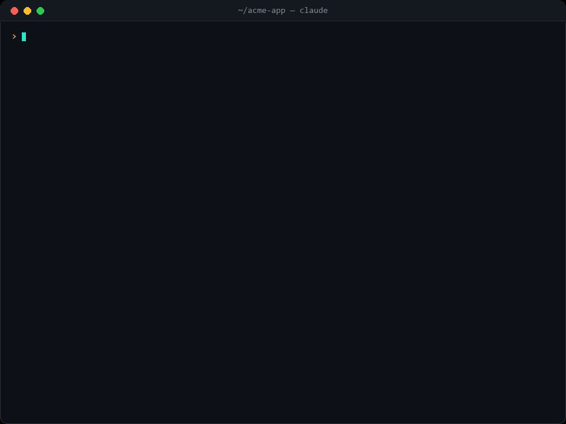
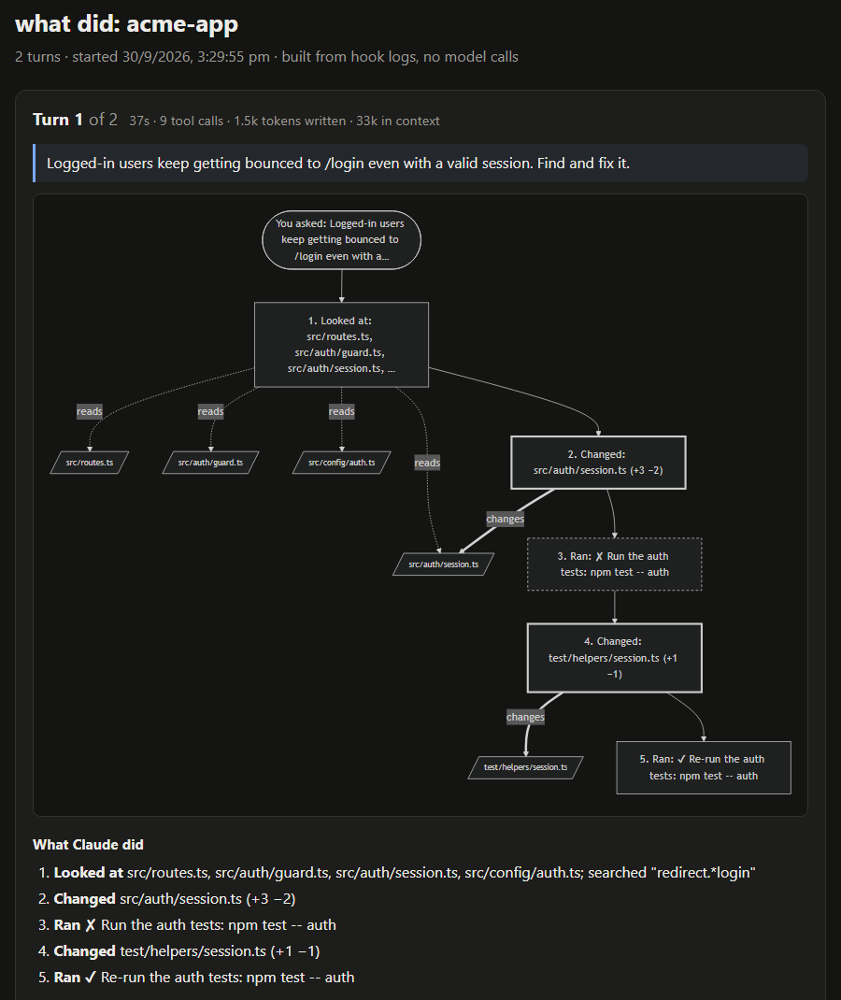
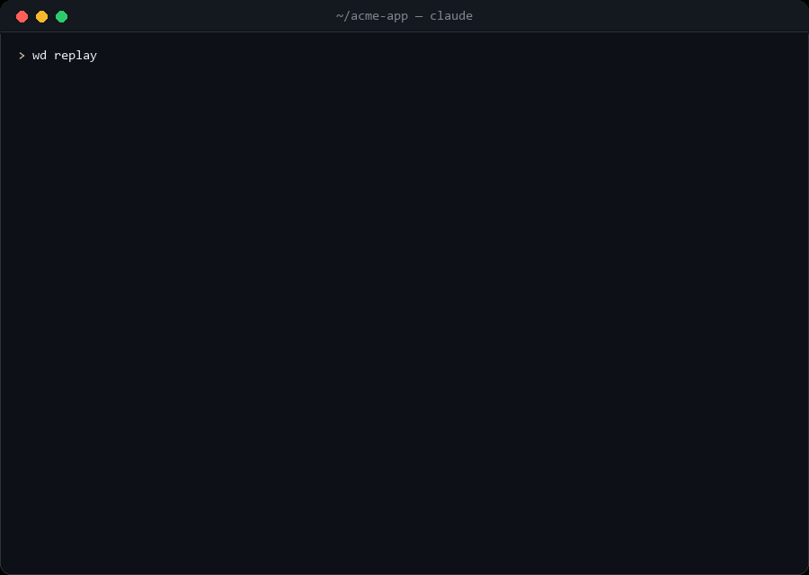
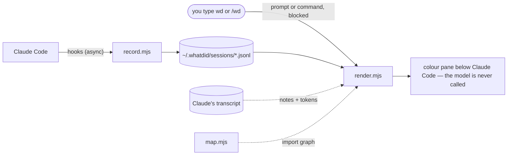

<p align="center">
  <picture>
    <source media="(prefers-color-scheme: dark)" srcset="assets/banner-dark.svg">
    
  </picture>
</p>

<h3 align="center">See what Claude Code did, in plain English, for zero tokens.</h3>

<p align="center">
  <a href="https://github.com/Vishy204/whatdid/actions/workflows/ci.yml"></a>
  <a href="LICENSE"></a>
  
  
  
  
</p>

<p align="center">
  <a href="#install">Install</a> ·
  <a href="#use">Use</a> ·
  <a href="#claude-narrates-as-it-works">Narration</a> ·
  <a href="#how-it-compares">How it compares</a> ·
  <a href="#how-it-works">How it works</a> ·
  <a href="#what-costs-tokens">Cost</a> ·
  <a href="#faq">FAQ</a>
</p>

<p align="center">
  
</p>

Claude Code's terminal is a firehose of `Read`, `Grep`, `Edit` and diffs. Most people can't follow it, so they paste it into another AI and ask what just happened.

**what did** records every step with hooks and turns it into a plain-English map. It shows what you asked, where Claude looked, what it changed, how those files connect, what it ran, what failed, and why. Type **`wd`** (or pick it from the **`/wd`** menu) and the map opens in a colour pane below Claude Code. The message never reaches the model, so it costs **0 tokens**.

Everything you look at is built by scripts, not by the model, so it's free. The one optional extra, **auto-map**, hands Claude a ~2k-token map of a big repo before it starts ([what costs tokens](#what-costs-tokens)).

## Install

Inside Claude Code:

```text
/plugin marketplace add Vishy204/whatdid
/plugin install whatdid@whatdid
```

Or from any terminal: `npx whatdid install`. Then restart Claude Code.

It needs Node 20+ (installed with Claude Code if you used npm) and has zero dependencies. It works on Windows, macOS and Linux, and CI tests all three.

## Use

Type any of these as your whole message, or type **`/wd`** and pick one from the menu, which says what each one does. None of them call the model.

| Type | Or pick | You get |
|---|---|---|
| **`wd`** | `/wd` | The last turn: what you asked, a one-line summary, Claude's answer, every step, files, connections, failures |
| `wd replay` | `/wd-replay` | Every step in order, with timings and Claude's reason for each |
| `wd diff` | `/wd-diff` | The exact lines Claude changed in the last turn, file by file, with line numbers |
| `wd html` | `/wd-html` | The session as a web page with a flowchart, opened in your browser |
| `wd map` | `/wd-map` | A ~2k-token map of the codebase: key files, symbols, who imports what. `wd map src` maps one folder |
| `wd 3` · `wd all` | `/wd 3` | The last 3 turns · the whole session |
| `wd help` | `/wd-help` | All of the above |

The menu may show the long name (`/whatdid:wd-map`); the short `/wd-map` does the same thing.

`wd why did you touch auth.ts` still goes to Claude as a normal question, because what did only answers the words it knows.

### What `wd` shows

```text
┌─ what did · turn 1 of 2 · 37s · 9 tool calls · 1.5k tokens written · 33k in context
│
│ You asked:  "Logged-in users keep getting bounced to /login even with a valid session. Find and fix it."
│ In short:   Read 4 files, searched once, edited 2 files (+4 −3 lines), ran 2 commands, 1 failed.
│
│ Health
│   ✔ tests       passed · Re-run the auth tests (2 runs)
│   ✔ commands    2 ran, 1 failed, 1 fixed later
│   ✎ files       2 changed (+4 −3)
│   ✔ unresolved  none
│
│ What Claude did
│   1. Looked at  src/routes.ts, src/auth/guard.ts, src/auth/session.ts, src/config/auth.ts
│   2. Changed    src/auth/session.ts (+3 −2)
│   3. Ran        ✘ Run the auth tests: npm test -- auth
│   4. Changed    test/helpers/session.ts (+1 −1)
│   5. Ran        ✔ Re-run the auth tests
│
│ Files  (R read · E edited · N new)
│  ├─ src/auth/
│  │  ├─ guard.ts    R
│  │  └─ session.ts  R E   +3 −2
│  └─ test/helpers/
│     └─ session.ts  E     +1 −1
│
│ Heads up: 1 step failed
│   ✘ Bash npm test -- auth
│
│ Claude's notes
│   ◇ found  expiresAt is in seconds but compared to Date.now() in ms
│   ✔ done   all 14 auth tests pass
└
```

| Section | What it is |
|---|---|
| **In short** | One plain-English line: how much Claude read, changed and ran, and whether anything failed |
| **Health** | Did tests pass, which commands failed, how many files changed, and whether any failure is still unresolved at the end |
| **Claude's answer** | How Claude's final message begins, so you get the conclusion without scrolling up |
| **What Claude did** | Every step, grouped. Commands show what they were for; the raw command only shows when it failed |
| **Files** | A tree of every file touched: **R** read, **E** edited, **N** new, with lines added and removed |
| **How it connects** | Import chains between the files Claude touched, e.g. `routes.ts ──▶ guard.ts ──▶ session.ts [edited]` |
| **Heads up** | Anything that failed |
| **Along the way** | One key line from each message Claude wrote while working, tagged with the step it led to, e.g. `(→ step 3)` |
| **Claude's notes · Recap** | With the narration style on: Claude's typed notes and its three-line recap |

**You don't even have to type it.** After every turn where Claude used tools, a one-line card appears on its own (hide it with `/wd-setup auto off`):

```text
◆ what did · 9 steps · 37s · changed session.ts +3 −2, +1 file · ✔ npm test -- auth · 1 failed earlier · type wd
  ✔ done all 14 auth tests pass
```

### The colour pane

In Windows Terminal, tmux, WezTerm, iTerm2 and kitty (with `allow_remote_control yes`), `wd` opens in a full-width pane below Claude Code, in colour. On a Mac in Terminal, Ghostty, VS Code or Warp, which can't be split from outside, it opens in a Terminal window instead. Each section gets its own coloured heading, steps are coloured by kind (looked at, changed, ran), and added and removed lines are green and red. A new `wd` replaces the old pane. Other terminals (Linux and Windows terminals that can't split) show the same map inside Claude Code, and `/wd-setup pane off` does that everywhere.

| Key | In the pane |
|---|---|
| `↑` `↓` · mouse wheel · `PgUp` `PgDn` | Scroll |
| Click a "+3 more" line · `e` | Show every step, command and file (`e` again to summarise) |
| `q` · `Esc` · `Enter` | Close |

**It taps you on the shoulder.** When a turn takes 20 seconds or more, your terminal pops a desktop notification with the same summary, so you can switch windows while Claude works. It works in Windows Terminal, iTerm2, WezTerm, Ghostty and kitty; `/wd-setup notify off` turns it off.

<details>
<summary><b>More: live statusline, HTML report, terminal command, settings</b></summary>

- **Live statusline:** `/wd-setup` adds a line at the bottom of the terminal showing Claude's latest note as it works (`◇ found expiresAt is seconds… · step 6 · editing session.ts`). If you already have a statusline, such as GSD's, it stays and shows first.
- **HTML report:** `wd html` writes one self-contained page. At the top, a list of every prompt, newest first, jumps straight to that turn. The three newest turns are open; click any older one to open it. Each turn has its health, a flowchart of every step and file (boxes show the full text, and hovering shows it too), the changed lines, the file tree and every note as a coloured badge. It runs no JavaScript and loads nothing from the network, so it works offline.

  

- **Outside Claude Code:** run `whatdid` in any project folder to see its latest session, in colour. `whatdid replay`, `whatdid doctor` and `whatdid map` also work.
- **A folder of many projects:** `wd map` in, say, your home folder lists the projects there instead of mixing them into one map.
- **Settings**, all with `/wd-setup`:

  | Setting | What it does |
  |---|---|
  | `/wd-setup` | Adds the live statusline |
  | `pane on` · `pane off` | Colour pane below Claude Code, or text inside it |
  | `auto on` · `auto off` | The one-line card after every turn |
  | `notify on` · `notify off` | The desktop notification after long turns |
  | `automap auto` · `on` · `off` | Preload the repo map into Claude's context (see [Auto-map](#auto-map)) |
  | `uninstall` | Removes the statusline and restores yours |

</details>

## Claude narrates as it works

Turn on the output style with `/output-style whatdid`. Claude then writes short, typed notes while it works, stays terse everywhere else, and ends every task with a three-line recap. You see the notes live in the terminal, and `wd`, the statusline, replay and the HTML report collect them.

| Note | Meaning |
|---|---|
| ◆ **why** | What Claude is about to do, and why. Written before every step. |
| ▸ **plan** | The approach, once, for multi-step work |
| ◇ **found** | The cause, or the key fact that changes the plan |
| ✔ **done** | A milestone reached, e.g. tests pass |
| ✘ **failed** | Something didn't work, and what Claude tries instead |
| ▲ **risk** | Something destructive, irreversible or uncertain: look here |
| ◌ **need** | Claude is blocked on your decision |

The recap is ✎ **changed**, ✔ **verified** and ○ **left**. It flips to ✘ or ▲ when something wasn't checked or is still open, so problems stand out.

<p align="center"></p>

## How it compares

| | Ask Claude "what did you do?" | Built-in `/recap` | Web replay viewers | **what did** |
|---|---|---|---|---|
| Cost | A full model call, re-reading the whole context | Built in | Free | **0 tokens** |
| Detail | Whatever Claude remembers | One line, when you come back | Everything, raw | **Files, diffs, commands, failures, reasons** |
| Source | Claude's own account | A summary | The transcript | **A factual log written by hooks** |
| After `/compact` | Only what survived compaction | — | Yes | **Everything, still on disk** |
| Where | Chat, adds to your context | Terminal | Browser | **A colour pane right in the terminal** |
| Explains *why* | Yes, in depth | — | Only raw thinking | **Typed notes + recap** |

Ask Claude when you want deep reasoning. Use `wd` for "what just happened, and did it work?" as often as you like. It's free.

## How it works



- **Zero tokens:** Claude Code lets a hook block a prompt, or a `/` command, and show a message instead. what did answers `wd` and the `/wd…` commands that way, so nothing goes to the API. It then opens the colour pane, or prints the map when the terminal can't split.
- **Never in Claude's way:** recording hooks run asynchronously and always exit 0, and a corrupt log never breaks a session.
- **Private:** everything stays on your machine. Logs hold paths, line counts, your prompts and commands with secrets redacted, never file contents.
- **Repo map:** regex symbol extraction for JS/TS, Python, Go, Rust and Java, import resolution, PageRank ranking, and line numbers in big files. A 1.9M-token codebase becomes a ~2k-token map in about 200 ms. Optionally preloaded into every session (see [Auto-map](#auto-map)).

## What costs tokens

Almost nothing. Every view is built by local scripts from the hook log, so the model never sees it.

| Feature | Tokens |
|---|---|
| `wd`, `wd replay`, `wd diff`, `wd 3`, `wd all`, `wd map`, `wd html`, `wd help`, and the `/wd…` commands | **0**: a hook answers, and the prompt never reaches the model |
| Colour pane, one-line card after each turn, desktop notification, live statusline, welcome hint | **0**: drawn by hooks and local scripts |
| Recording every step | **0**: hooks write to `~/.whatdid` in the background |
| Having the plugin installed | ~200 tokens per session: the descriptions of the skills Claude can use (the `/wd` commands add none) |
| `/wd-explain` | A normal Claude reply: Claude reads the map and explains it in plain English. `wd` shows the same map for free |
| Narration style (`/output-style whatdid`, optional) | ~700 tokens of instructions, plus one short line per step. It also tells Claude to drop filler |
| **Auto-map** (optional, off by default) | **~2k tokens at the start of every session** |

Claude Code caches the start of a session, so the fixed costs above are billed in full once, then at the much cheaper cached rate on later turns.

## Auto-map

**What it does.** When a session starts, what did adds a ~2k-token map of the repo to Claude's context. It lists the most central files, their functions and classes, who imports what, and line numbers into every file over 300 lines. It's the same map `wd map` shows you.

**How it helps.** Claude knows where things live before it reads anything. Instead of grepping around and reading a 4,000-line file top to bottom, it can open `session.ts` at line 240 and read the 100 lines that matter. That matters most on big codebases that don't fit in Claude's head.

**What it costs.** ~2k tokens per session, about as much as Claude reading one medium-sized file. We tested whether it pays that back on five large open-source codebases. Each got four architecture questions, asked three times with and three times without auto-map, read-only, on haiku:

| Codebase | Language | Source | Correct without → with | Cost with auto-map |
|---|---|---|---|---|
| [fastapi](https://github.com/fastapi/fastapi) | Python | ~0.9M tokens | 11/12 → 12/12 | **−43%** |
| [pydantic](https://github.com/pydantic/pydantic) | Python + Rust | ~1.9M tokens | 12/12 → 12/12 | **−23%** |
| [excalidraw](https://github.com/excalidraw/excalidraw) | TypeScript | ~1.5M tokens | 11/12 → 12/12 | **−17%** |
| [hugo](https://github.com/gohugoio/hugo) | Go | ~1.6M tokens | 11/12 → 12/12 | **−16%** |
| [tokio](https://github.com/tokio-rs/tokio) | Rust | ~1.5M tokens | 12/12 → 12/12 | +21% |
| **All five** | | | **57/60 → 60/60** | **−17%** (input tokens −21%) |

Cost is what Claude Code reports for each run (`total_cost_usd`), using the median of the three runs per question. Single runs vary a lot (the same question can take 9 turns or 26), so the total across all five is the number to trust. Per-question results are in [`bench/results`](bench/results/2026-10-01-haiku-large-public-r3.md).

**Turn it on:**

```text
/wd-setup automap auto    only for big codebases (~400k+ tokens of source)
/wd-setup automap on      every session
/wd-setup automap off     back to the default
```

**Measure it on your own repo.** Write a few questions and run `node bench/local.mjs <repo> <questions.json>`. It's read-only (Claude can only Read, Grep and Glob) and confirms that git status is unchanged afterwards. The public suites are pinned to exact commits, so anyone can rerun them: `node bench/local.mjs bench/large/hugo.json`.

## FAQ

<details><summary><b>Why does it say "UserPromptSubmit operation blocked by hook"?</b></summary>

That's how Claude Code shows a prompt a hook has answered, and blocking it is what keeps `wd` free. With the colour pane it's a single line pointing at the pane; in terminals without one, the map appears right under it.
</details>

<details><summary><b>Does it slow Claude down or change what it does?</b></summary>

The recording hooks run asynchronously and add no tokens. Only the optional output style changes Claude's replies: it adds short note lines and tells Claude to drop filler.
</details>

<details><summary><b>Does it work with GSD, caveman and other plugins?</b></summary>

Yes. what did only observes. It keeps any statusline you already have, and its notes work alongside other styles' rules.
</details>

<details><summary><b>Where is my data, and how do I remove it?</b></summary>

It's in `~/.whatdid/`, private to you, with common secrets redacted before anything is written ([SECURITY.md](SECURITY.md)). Delete that folder to remove it. `whatdid uninstall` removes the plugin and restores your previous statusline.
</details>

## Roadmap

- [x] Zero-token map, replay, HTML report, repo map, live statusline, auto card, typed narration
- [x] Colour pane with scrolling and expand, `/wd` menu, desktop notifications
- [x] `wd diff`, session health, offline HTML report
- [ ] Codex CLI and Gemini CLI support
- [ ] More benchmarks: more codebases, more runs, bigger models
- [ ] Share a session as a link

## Contributing

```bash
npm test                          # 73 tests, node --test, zero dependencies
npm run demo                      # the demo session, no API calls
claude --plugin-dir .             # run Claude Code with your working copy
python assets/src/make_gifs.py    # regenerate the README GIFs from the real renderer
```

Issues and PRs are welcome. Please keep it zero-dependency and working on Windows.

<p align="center"><sub>MIT © Vishy204 · Not affiliated with Anthropic. Claude and Claude Code are trademarks of Anthropic.</sub></p>
